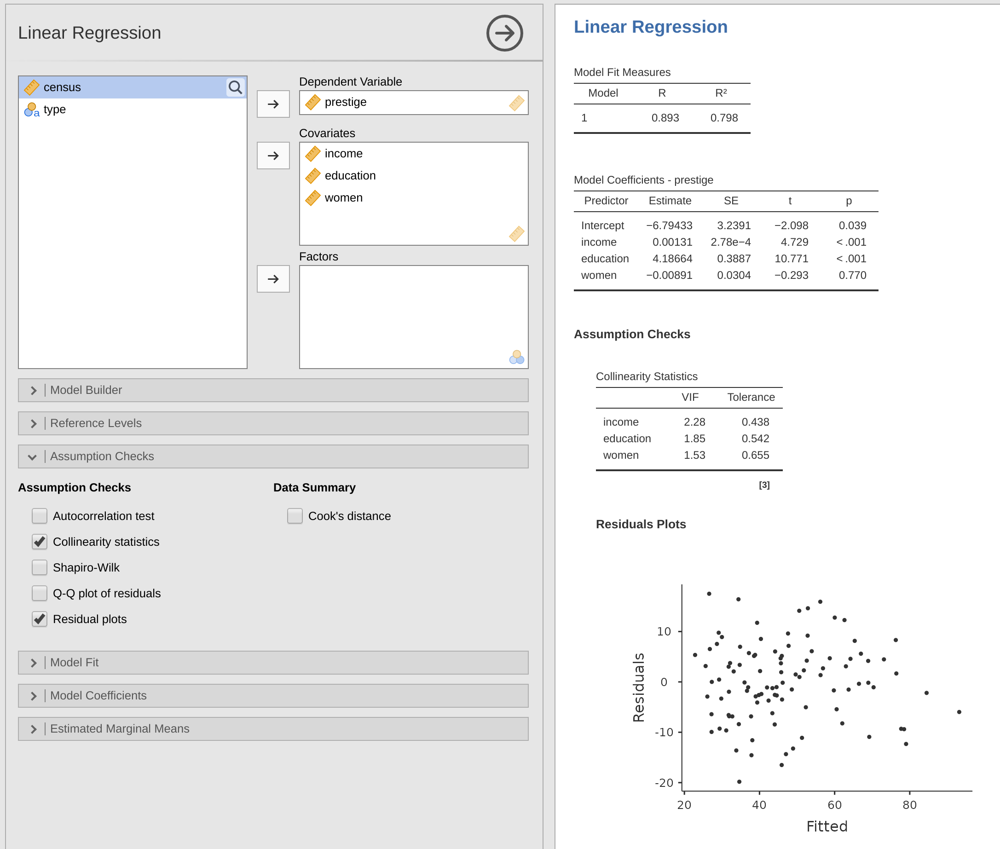

```{r setup, include=FALSE}
knitr::opts_chunk$set(echo = TRUE, message=F, warning=F, fig.path = "img/")
library(printr)
```

## Introduction

This document shows how to conduct and report a basic regression analysis.
Different alternatives are given below to help decide.

### Data and model

We will use the [Prestige](https://www.rdocumentation.org/packages/car/versions/2.1-6/topics/Prestige) data set:

```{r}
data('Prestige', package='carData')
head(Prestige)
```

This gives data on a number of occupations: years of education, dollar income, percentage female, Pineo-Porter prestige score, cencus code, and type (blue, white, professional).  We wish to model prestige from income, education, and gender distribution. 

### Desired output:

*Diagnostics:* (taken from premaster exercise 2)
  + Collinearity diagnostics
  + Plot of residual vs predicted
  + ...?

*Model output:*
  + As close to APA norms as possible?
  + B or Beta?
  + SE or CI?
  + p-value and stars?
  + R2 and Adj. R2
    
# Analyses {.tabset}
    
## Jamovi

(Q: is there a better way to get built-in data into jamovi than exporting it from R and importing it in jamovi?)



## jmv
   
Note: generated from jamovi, only changed data to Prestige
    
```{r regression-jmv}
library(jmv)
jmv::linReg(
  data = Prestige,
    dep = prestige,
    covs = vars(income, education, women),
    blocks = list(c("income", "education", "women")),
    resPlots = TRUE,
    collin = TRUE)
```

## base-R

```{r regression-lm}
m = lm(prestige ~ income + education + women, data=Prestige)
summary(m)
par(mfrow=c(2,2))
plot(m)
```

## Stargazer

```{r regression-stargazer, results='asis'}
library(stargazer)
m = lm(prestige ~ income + education + women, data=Prestige)
stargazer(m, type="html")
```

## easystats

```{r regression-easystats}
library(performance)
m = lm(prestige ~ income + education + women, data=Prestige)
check_model(m)
```