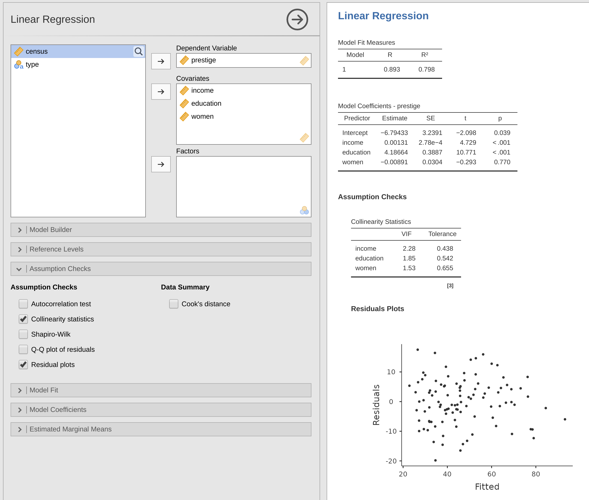
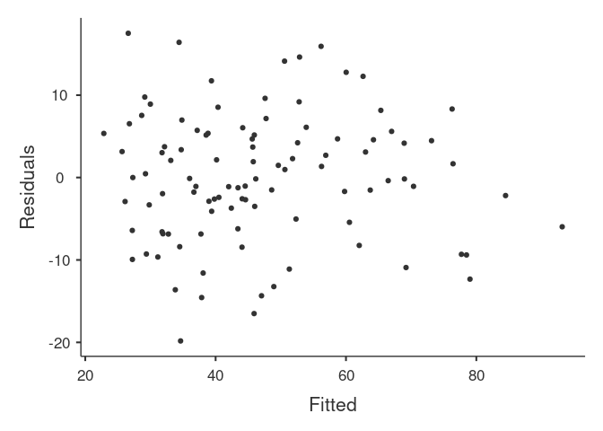
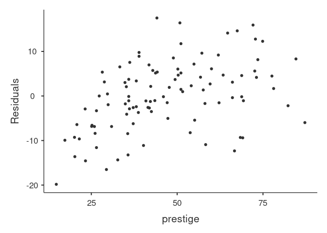
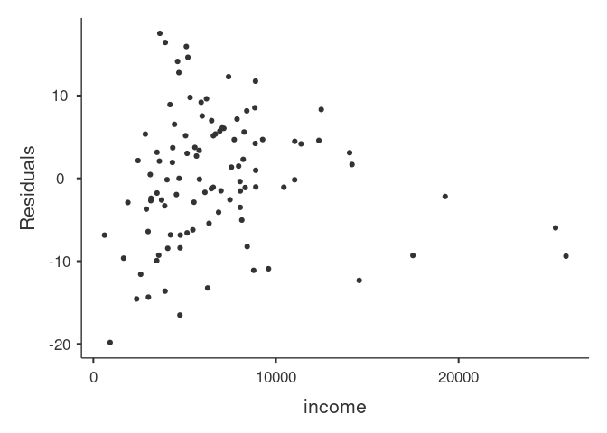
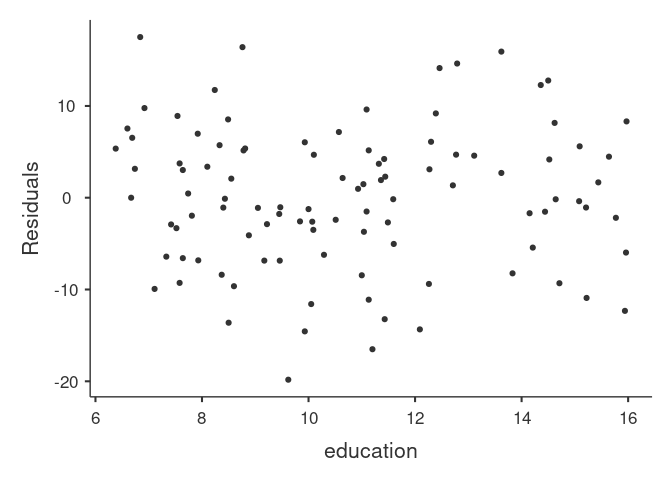
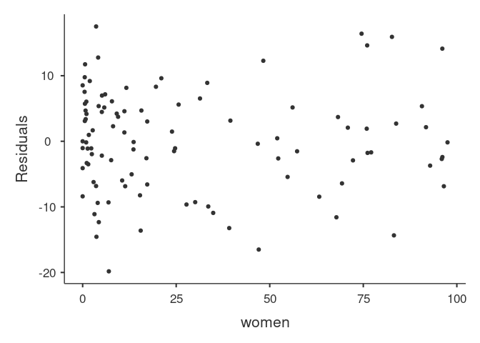

Basic regression
================

## Introduction

This document shows how to conduct and report a basic regression
analysis. Different alternatives are given below to help decide.

### Data and model

We will use the
[Prestige](https://www.rdocumentation.org/packages/car/versions/2.1-6/topics/Prestige)
data set:

``` r
data('Prestige', package='carData')
head(Prestige)
```

    ##                     education income women prestige census type
    ## gov.administrators      13.11  12351 11.16     68.8   1113 prof
    ## general.managers        12.26  25879  4.02     69.1   1130 prof
    ## accountants             12.77   9271 15.70     63.4   1171 prof
    ## purchasing.officers     11.42   8865  9.11     56.8   1175 prof
    ## chemists                14.62   8403 11.68     73.5   2111 prof
    ## physicists              15.64  11030  5.13     77.6   2113 prof

This gives data on a number of occupations: years of education, dollar
income, percentage female, Pineo-Porter prestige score, cencus code, and
type (blue, white, professional). We wish to model prestige from income,
education, and gender distribution.

### Desired output:

*Diagnostics:* (taken from premaster exercise 2) + Collinearity
diagnostics + Plot of residual vs predicted + …?

*Model output:* + As close to APA norms as possible? + B or Beta? + SE
or CI? + p-value and stars? + R2 and Adj. R2

## Jamovi

(Q: is there a better way to get built-in data into jamovi than
exporting it from R and importing it in jamovi?)



## jmv

Note: generated from jamovi, only changed data to Prestige

``` r
library(jmv)
jmv::linReg(
  data = Prestige,
    dep = prestige,
    covs = vars(income, education, women),
    blocks = list(c("income", "education", "women")),
    resPlots = TRUE,
    collin = TRUE)
```

    ## 
    ##  LINEAR REGRESSION
    ## 
    ##  Model Fit Measures                  
    ##  ─────────────────────────────────── 
    ##    Model    R            R²          
    ##  ─────────────────────────────────── 
    ##        1    0.8934078    0.7981775   
    ##  ─────────────────────────────────── 
    ## 
    ## 
    ##  MODEL SPECIFIC RESULTS
    ## 
    ##  MODEL 1
    ## 
    ##  Model Coefficients - prestige                                            
    ##  ──────────────────────────────────────────────────────────────────────── 
    ##    Predictor    Estimate        SE             t             p            
    ##  ──────────────────────────────────────────────────────────────────────── 
    ##    Intercept    -6.794334203     3.23908865    -2.0976067     0.0385131   
    ##    income        0.001313560    2.777812e-4     4.7287593     0.0000076   
    ##    education     4.186637275     0.38870126    10.7708353    < .0000001   
    ##    women        -0.008905157     0.03040706    -0.2928648     0.7702447   
    ##  ──────────────────────────────────────────────────────────────────────── 
    ## 
    ## 
    ##  ASSUMPTION CHECKS
    ## 
    ##  Collinearity Statistics                
    ##  ────────────────────────────────────── 
    ##                 VIF         Tolerance   
    ##  ────────────────────────────────────── 
    ##    income       2.282038    0.4382048   
    ##    education    1.845165    0.5419570   
    ##    women        1.526593    0.6550535   
    ##  ──────────────────────────────────────

<!-- --><!-- --><!-- --><!-- --><!-- -->

## base-R?

## easystats
